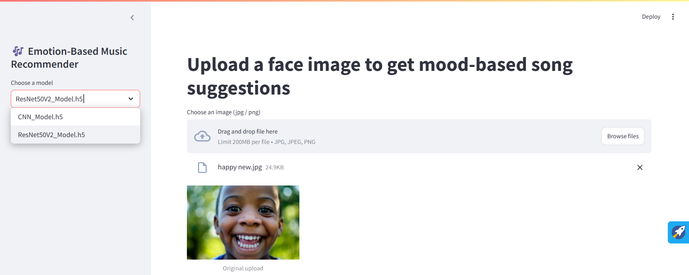
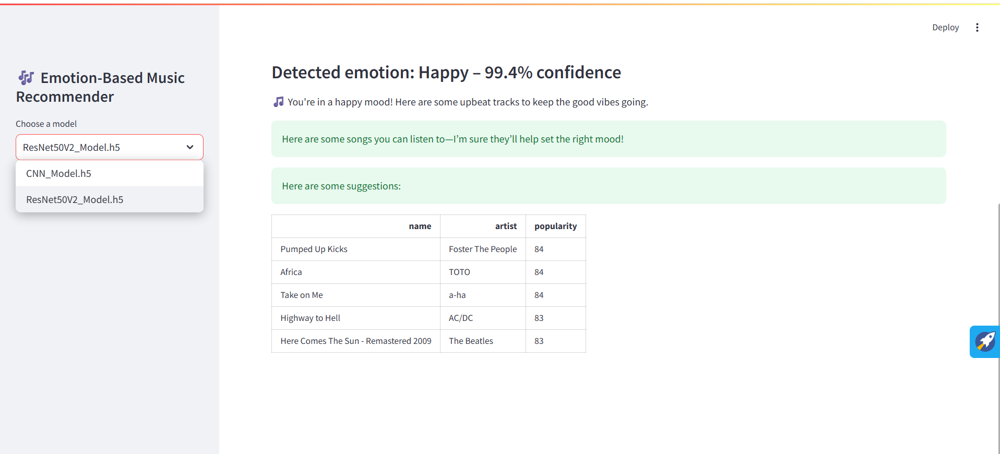
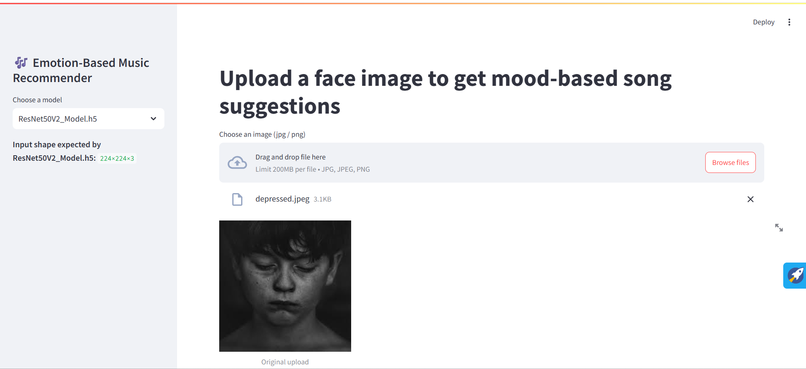
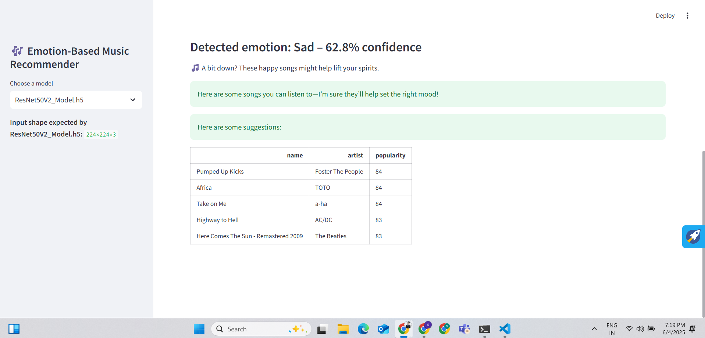

# 🎶 Music Models Collection

This repository contains three distinct music-related models, each with its own folder and README. Below is an overview of each model, the final folder structure, and next steps to get everything organized and running.






[](https://youtu.be/AoSP1-LiaRU)

---

## 1. Emotion-Based Music Recommender

### 📌 Overview
A facial-emotion detection model built on **ResNet50v2** that recommends Spotify songs based on detected emotions such as Happy, Sad, Angry, and Neutral.

### 📊 Model Details
- **Architecture:** ResNet50v2 (fine-tuned)
- **Datasets:** FER (Facial Emotion Recognition), Spotify Emotion Dataset
- **Libraries:** TensorFlow, Keras, OpenCV, NumPy, Pandas
- **Accuracy:** 96.6%

### 📥 How to Run
1. Clone this repository and navigate to the folder:
```bash
cd Model/Emotion-Based-Music-Recommender
```
2. Install dependencies:
```bash
pip install -r requirements.txt
```
3. Run Jupyter Notebook:
```bash
jupyter notebook emotion_model.ipynb
```

---

## 2. Spotify Emotion Classifier

### 📌 Overview
This model classifies Spotify songs into emotion categories (Happy, Sad, Energetic, Calm) using deep learning and audio features extracted with Librosa.

### 📊 Model Details
- **Model Type:** LSTM/CNN hybrid
- **Dataset:** 278,000 Emotion-Labeled Spotify Songs
- **Feature Extraction:** Librosa (MFCCs, Chroma Features, Spectral Contrast)
- **Libraries:** TensorFlow, Librosa, Pandas, NumPy, Scikit-learn
- **Accuracy:** 92.4%

### 📥 How to Run
1. Navigate to the directory:
```bash
cd Model/Spotify-Emotion-Predictor
```
2. Install dependencies:
```bash
pip install -r requirements.txt
```
3. Run Jupyter Notebook:
```bash
jupyter notebook spotify_emotion_classifier.ipynb
```

---

## 3. Music Genre Classifier

### 📌 Overview
A CNN-based model performing multiclass genre classification of music using Librosa-extracted audio features.

### 📊 Model Details
- **Model Type:** CNN
- **Dataset:** MIR (Music Information Retrieval) Dataset
- **Feature Extraction:** Spectrograms, MFCCs
- **Libraries:** TensorFlow, Keras, NumPy, Pandas, Librosa
- **Accuracy:** 89.7%

### 📥 How to Run
1. Enter the directory:
```bash
cd Model/Music-Genre-Classification
```
2. Install dependencies:
```bash
pip install -r requirements.txt
```
3. Launch the notebook:
```bash
jupyter notebook music_genre_classifier.ipynb
```

---

## 📁 Final Folder Structure

```
Model/
├── Emotion-Based-Music-Recommender/
│   ├── emotion_model.ipynb
│   └── README.md
│
├── Spotify-Emotion-Predictor/
│   ├── spotify_emotion_classifier.ipynb
│   └── README.md
│
└── Music-Genre-Classification/
    ├── music_genre_classifier.ipynb
    └── README.md
```

---

## ✅ Next Steps

1. **Ensure each `.ipynb` file** is placed into its respective subfolder.
2. **Verify each README.md file** in its designated folder.
3. **Commit and Push to GitHub**:
```bash
git add Model/
git commit -m "Added music models and README files"
git push origin main
```

---

## 📜 License
All projects are licensed under the [MIT License](LICENSE). See each project's LICENSE file for details.

---

## 🛠️ Contribution
Feel free to open an issue or submit a pull request for improvements and suggestions!
